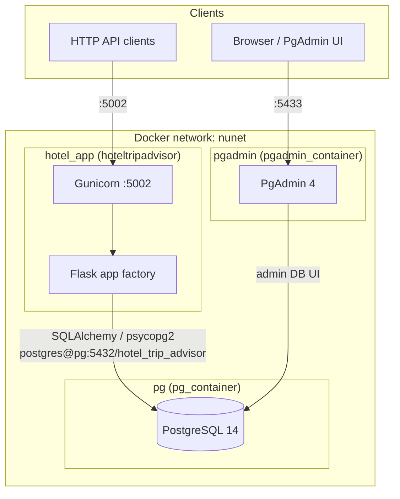
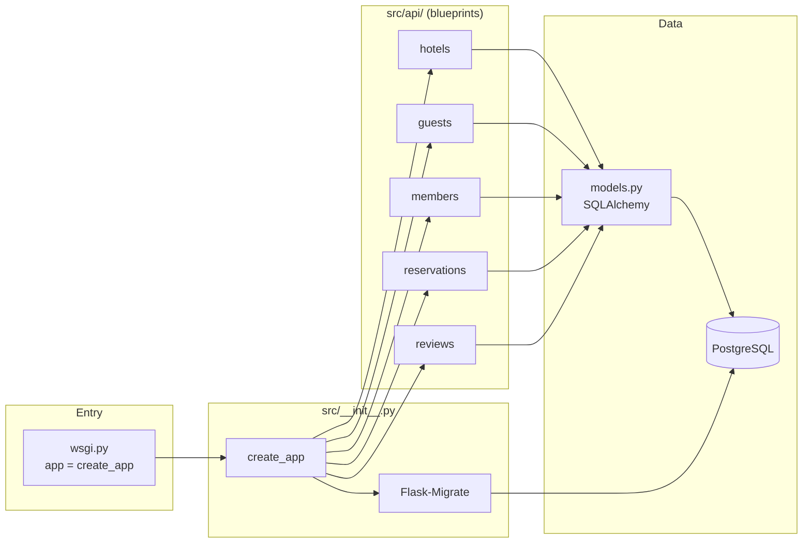

# Architecture

High-level views of **hotel_trip_advisor_v2**: how it runs in Docker, how HTTP requests flow through Flask, and how domain entities relate in PostgreSQL.

---

## 1. Deployment (Docker Compose)

External clients and operators reach the stack via published ports. The Flask app talks to Postgres on the internal Docker network.



**Notes**

- **Gunicorn** binds `0.0.0.0:5002` in the container (`flask/hotel_tripadvisor/Dockerfile`); Compose maps **host `5002` → container `5002`**.
- **Postgres** listens on `5432` inside the network; the app uses `SQLALCHEMY_DATABASE_URI` pointing at host **`pg`** (service name).
- Optional init SQL can be mounted via `data/initdb/` → `/docker-entrypoint-initdb.d/` (see `docker-compose.yml`).

---

## 2. Application layers

Request path: WSGI entry → app factory → blueprints (REST-style routes) → SQLAlchemy models → database. Schema changes go through **Flask-Migrate** (Alembic).



---

## 3. Data model (conceptual ERD)

Relationships as implemented in `src/models.py` (simplified for readability).

```mermaid
erDiagram
    Hotel ||--o{ Room : "has"
    Hotel ||--o{ Review : "about"
    Hotel ||--o{ Reservation : "at"
    Guest ||--o| Member : "may have"
    Guest ||--o{ Reservation : "books"
    Member ||--o{ Review : "writes"
    Member }o--o{ Review : "likes via review_likes"

    Hotel {
        int hotel_id PK
        string name
        string address
        float star_rating
        int number_of_rooms
    }

    Room {
        int hotel_id PK_FK
        int room_id PK
        string room_type_name
        float room_default_price
    }

    Guest {
        int guest_id PK
        string first_name
        string last_name
        date date_of_birth
        string email
        string phone
    }

    Member {
        int member_id PK
        int guest_id FK
        string username
        string password
        datetime join_date
        int points
    }

    Review {
        int review_id PK
        int member_id FK
        int hotel_id FK
        string content
        int rating
        datetime created_at
    }

    Reservation {
        int reservation_id PK
        int hotel_id FK
        int guest_id FK
        int room_number
        datetime booking_date
        date arrival_date
        date departure_date
        int number_of_nights
    }
```

The **`review_likes`** association table links `members` and `reviews` (many-to-many for likes).

---

## Viewing these diagrams

- **GitHub / GitLab**: Mermaid renders in Markdown previews.
- **VS Code / Cursor**: Use a Mermaid preview extension, or paste into [mermaid.live](https://mermaid.live).
